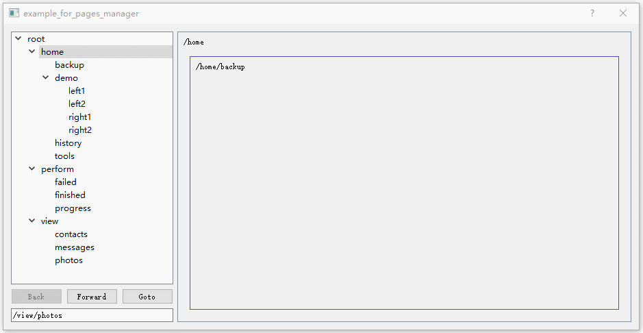

# PagesManager

一个基于Qt的极简页面管理器，仅有一个`pages_manager.hpp`文件。

## 介绍

在一个UI具有多级页面的应用程序中，内部的每一个UI页面需要互相解耦(即 隔离--对彼此来说互相不可见)，但又需要在多级页面间来回切换，以及保证事件与数据可以方便的互相传递。并且通常情况下页面应该是无状态的，由数据驱动(数据决定页面的内容，而这个数据可以以任何形式存储在任何地方)。

举例来说:

1. 有一个查看设备内容的 "浏览页面"，当浏览A设备时将产生一个 "A 设备内容" 的状态(或数据)，同理B设备也会产生一个 "B 设备内容" 的状态，分别记作: ViewPage(DeviceA)，ViewPage(DeviceB)。

2. 当用户从 ViewPage(DeviceB) 页面切换到 ViewPage(DeviceA)，之后又点击 "back" 返回到 ViewPage(DeviceB)，再点击 "forward" 跳转 ViewPage(DeviceA)。 在开发的角度上来说，页面并没有切换，但页面的数据(内容)不同了。

3. 通过无状态的页面设计可以很好的完成这种实现，可以将页面理解为一个视图，视图要渲染的数据(如DeviceA的内容)则保存在某个地方，我们只需要在页面切换时，将数据传递进来由页面渲染即可，也就是MVC设计思想。



## 构建 Example

```shell
$ git clone https://github.com/ZeroKwok/pages_manager.git
$ cd pages_manager && mkdir build && cd build
$ cmake .. -DCMAKE_PREFIX_PATH:PATH="YOUR_QT_INSTALL_DIR"
$ cmake --build .
```

## 使用

1. 可以简单的拷贝 `pages_manager.hpp` 到你的项目的源代码目录，然后直接使用。
2. 也可以通过下面的代码将 `pages_manager` 作为一个子模块添加到你的项目。

```cmake
add_subdirectory(pages_manager)
qt5_wrap_cpp(QtMocFiles ${PAGES_MANAGER_INCLUDE_DIR}/pages_manager.hpp)
add_executable(${PROJECT_NAME} main.cpp ${QtMocFiles})
target_link_libraries(${PROJECT_NAME} PRIVATE pages_manager)
```
